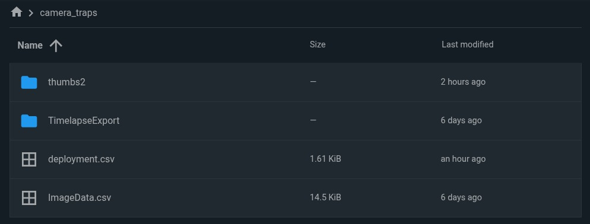

# gc-wildlife-viewer: R Shiny app for exploring wildlife media and data 

This app exposed a map and filters to explore camera trap images.  The goal is
a intuitive view that could be deployed as part of Guardian Connector CapRover
deployments.

## Data Setup

### Data source requirements

This current version of the app requires 2 data sources: 

1. A CSV exported from Timelapse.exe (`ImageData.csv`)
2. A folder of images exported from Timelapse.exe (`TimelapseExport/`)

Not required, but strongly recommended is:

3. A CSV with deployment metadata (`deployment.csv`)

If you do not have deployment data, the app will spoof locations with random lat/lon values. These are currently hardcoded in the app to a specific location, and so will need to be changed in the future to support other locations without deployment data.

### Timelapse data export

The Timelapse data are stored in a sqlite DB, but this script is set up to use an exported csv from Timelapse.  When setting up this app you need to export a **selection**. Providing access to the full dataset is not yet supported.  

1. Use the selection menu to select the subset of images that you want to work with (e.g. images marked "Favorite" or images that have non-blank data fields for local_name)
2. Export the tabular data as a CSV file Use **File → Export or import data to/from a csv file → Export image/video data in the current selection to a csv...** within Timelapse.
3. To export the selection of images for the dashboard use **File → Copy Image/video files to another folder → Copy all Image or Video files in the current selection to...** 

You should now have a `ImageData.csv` file and a `TimelapseExport` folder.

### Deployment data

The deployment data is a CSV that must contain the following columns:
- `location_name`: Location name (lowercased; join key with metadata)
- `region`: Region (join key with metadata)
- `camera_name`: Camera name (joined to metadata `camera`)
- `deployment_date`: Deployment date (`mdy` format; combined with `deployment_time`)
- `deployment_time`: Deployment time (combined with `deployment_date` into `deployment_datetime` UTC)
- `retrieval_date`: Retrieval date (`mdy` format; combined with `retrieval_time`)
- `retrieval_time`: Retrieval time (combined with `retrieval_date` into `retrieval_datetime` UTC)
- `latitude`: Latitude of the location (joined onto metadata for the map)
- `longitude`: Longitude of the location (joined onto metadata for the map)

Rows are joined to metadata on `location_name`, `region`, and `camera`/`camera_name`, with the image `datetime` falling between `deployment_datetime` and `retrieval_datetime`.

> [!NOTE]
>
> Currently, the CSV filename is hardcoded in the app as `deployment.csv`. In the future, we may make this configurable via an environment variable.


### Where to put the data

Currently, the app expects the data to live in the `camera_traps` folder on the `datalake` mount.

The easiest way to get the data into the `camera_traps` folder is to use the [FileBrowser](https://docs.guardianconnector.net/reference/gc-toolkit/filebrowser/) app. Navigate to the `camera_traps` folder (create it if it doesn't exist) and upload the files there. It should look like this:




> [!IMPORTANT]
>
> The app **relies** on the `ImageData.csv` file.  If this file is modified or removed
the app will crash. 
>
> To avoid this scenario, we set up the app with two volume
mounts, the `datalake` (where users have access and can rename, delete, etc via
FileBrowser) and a `gc-wildlife` where only admin have access.  
>
> The app will
check for the file in the `gc-wildlife` mount and if it doesn't exist it will make
a copy of the file there, and then read from that location.

### Not yet supported

- Full export from Timelapse: Use **File → Export or import data to/from a csv file → Export all data (folder data, image/video data) to csv files...** within Timelapse. 
- Configuring the path to the data in the app (currently, `camera_traps` and `deployment.csv` are hardcoded) is not yet supported.

## Deployment with Docker

### 1. Build the Docker Image

The `shiny` user inside the container needs to read files you mount from your host machine. To make this work, build the image with your user's UID/GID:

```bash
docker build --build-arg SHINY_UID=$(id -u) --build-arg SHINY_GID=$(id -g) -t guardiancr.azurecr.io/gc-wildlife-viewer:latest .
```

If deploying to a server where the data files are owned by a different user, use that user's UID/GID instead.
If you installed CapRover on a fresh VM, the correct UID and GID to use there are most likely `1000`.

### 2. Run Locally with Docker

```bash
docker run -p 3838:3838 -v "$(pwd)/data_mount:/data_mount" guardiancr.azurecr.io/gc-wildlife-viewer:latest
```

Then open http://localhost:3838

> [!TIP]
>
> You can run this image tag locally without needing to authenticate to the container registry.

### 3. Deploy to CapRover

1. Push the Docker image to a container registry that's hooked up in your CapRover deployment (CMI uses `guardiancr.azurecr.io`), e.g.

   ```bash
   docker push guardiancr.azurecr.io/gc-wildlife-viewer:latest
   ```

2. Create a new app in CapRover, making sure to check **Has Persistent Data**.

3. In **App Configs > Environment Variables**, add:
   ```
   APP_DATA_PATH=/data_mount
   ```

4. In **App Configs > Persistent Directories**, add a volume mount:
   - Path in App: `/data_mount`
   - Map to a host path or named volume containing your data

5. If you need password protection, in **HTTP Settings > Edit HTTP Basic Auth** assign a username and password. This approach does not allow multiple different usernames.

6. Set the **Container HTTP Port** to `3838`.

7. Under the **Deployment** tab, use "Method 6: Deploy via ImageName"

## Development Notes

### Project Structure

_Relevant files for development only:_

```
.
├── app/
│   ├── app.R              # Your Shiny application
│   └── shiny-app.Rproj    # RStudio project file
├── data_mount/            # Put data files here for LOCAL development
├── Dockerfile             # Dockerfile for the app, where packages are installed
├── shiny-server.conf
```

### Development with RStudio

Open `app/shiny-app.Rproj` in RStudio and click "Run App". The app will read from `data_mount/` in the repo root.

### Data Paths

Your app reads data from `APP_DATA_PATH`:
- **Local development:** Defaults to `../data_mount` (relative to `app/`)
- **Docker:** Set to `/data_mount` via the `.Renviron` file in the image

In your R code:

```r
APP_DATA_PATH <- Sys.getenv("APP_DATA_PATH", unset = "../data_mount")

# Helper to build paths
data_path <- function(...) file.path(APP_DATA_PATH, ...)

# Use it
my_data <- read.csv(data_path("my_data.csv"))
```

### Adding R Packages

Install packages in the Dockerfile, not in the `app.R` file. Edit the Dockerfile:

```dockerfile
RUN R -e "install.packages(c('dplyr', 'ggplot2', 'plotly'), repos='https://cloud.r-project.org')"
```

This keeps container startup fast and ensures reproducible builds.

### Get building! Your next steps are:

1. Edit `app/app.R` to build your application
2. Add data files to `data_mount/` for local testing
3. Update the Dockerfile to install any packages you need
4. Rename `shiny-app.Rproj` if you like

## Troubleshooting

If you encounter this error message on startup:

```
[INFO] shiny-server - Error getting worker: Error: The application exited during initialization.
```

That is an indicator that you might be missing an R package, or that something in the R code is not working as expected. 

-Turn on logging by uncommenting `preserve_logs true;` in `shiny-server.conf`
- Find the container ID using `docker ps`
- Open a shell to the container using `docker exec -it <container_id> /bin/bash`
- Check the logs on the container in `/var/log/shiny-server/` for more information.

See https://github.com/rstudio/shiny-server/issues/353 for more information.